# Image Classification on TinyImageNet-100

Comparative study of computer vision techniques: from traditional feature extraction to deep convolutional networks.

## Project Overview

**Dataset:** TinyImageNet-100 (100 classes, 64x64 images)
**Phases:**
1. **Traditional CV**: SIFT/ORB + Bag of Words + Fisher Vector + SVM
2. **Deep Learning (FCNN)**: Fully Connected Networks with Keras
3. **PyTorch Implementation**: FCNN with data augmentation and LR scheduling
4. **Advanced CNN**: Convolutional architectures

---

## Key Results Summary

| Model | Approach | Key Features | Status |
|-------|----------|--------------|---------|
| ORB + BoW | Traditional | Bag of Words (k=100), Linear SVC | Baseline |
| ORB + Fisher | Traditional | GMM (64 components), Fisher Vector | Improved |
| SIFT + BoW | Traditional | RBF SVM (C=10, γ=0.01) | Robust |
| FCNN (Keras) | Deep Learning | 64x64 flatten, Adam optimizer | Entry DL |
| FCNN + BN/Dropout | Deep Learning | Batch Norm, Dropout(0.25), Class weights | Regularized |
| **Phase 3 FCNN** | **Deep Learning** | **Augmentation, ReduceLROnPlateau** | **Best FCNN** |
| **Phase 4 CNN** | **Deep Learning** | **Convolutional Layers** | **Best Overall** |

---

## Visualizations

### 1. Traditional Computer Vision Results

#### ORB + Bag of Words (Linear SVC)
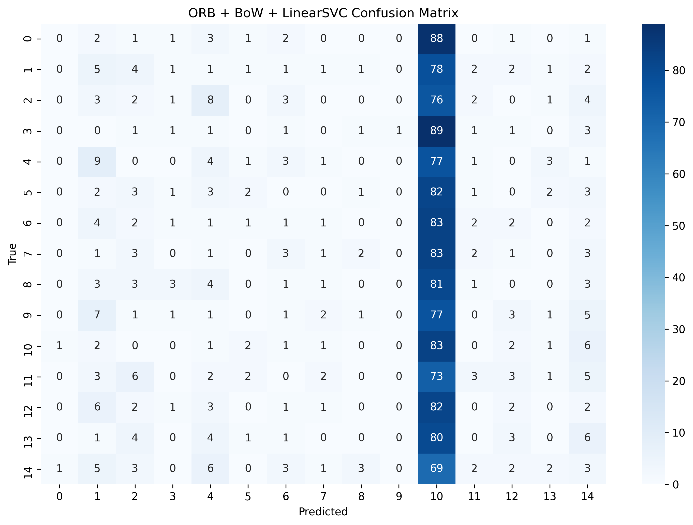

#### ORB + Fisher Vector (GMM-64)
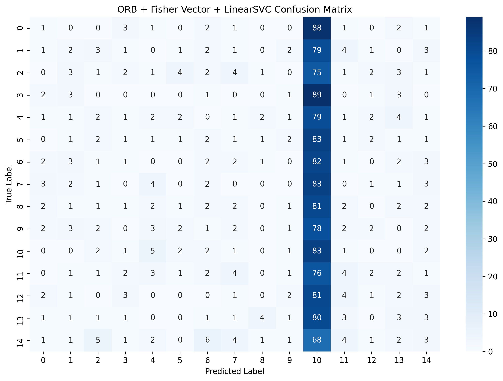

#### SIFT + Bag of Words (RBF SVM)
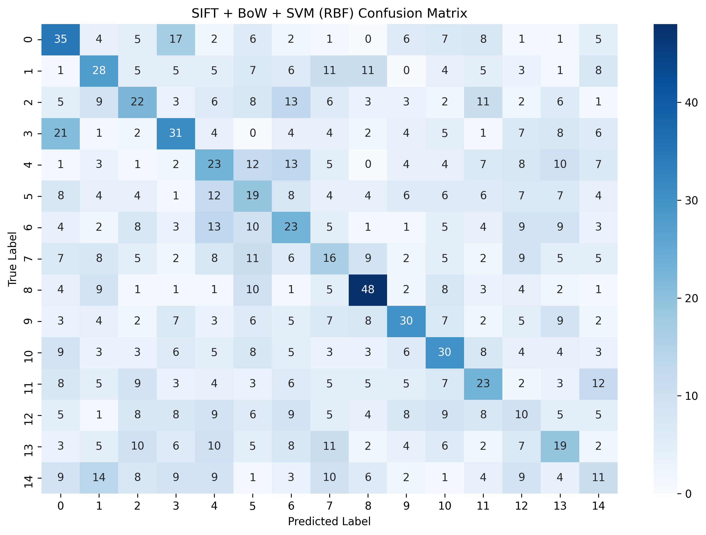

---

### 2. Deep Learning: Fully Connected Networks (Keras)

#### Baseline FCNN (64x64 Flatten)
**Architecture**: Flatten → Dense layers with Adam optimizer

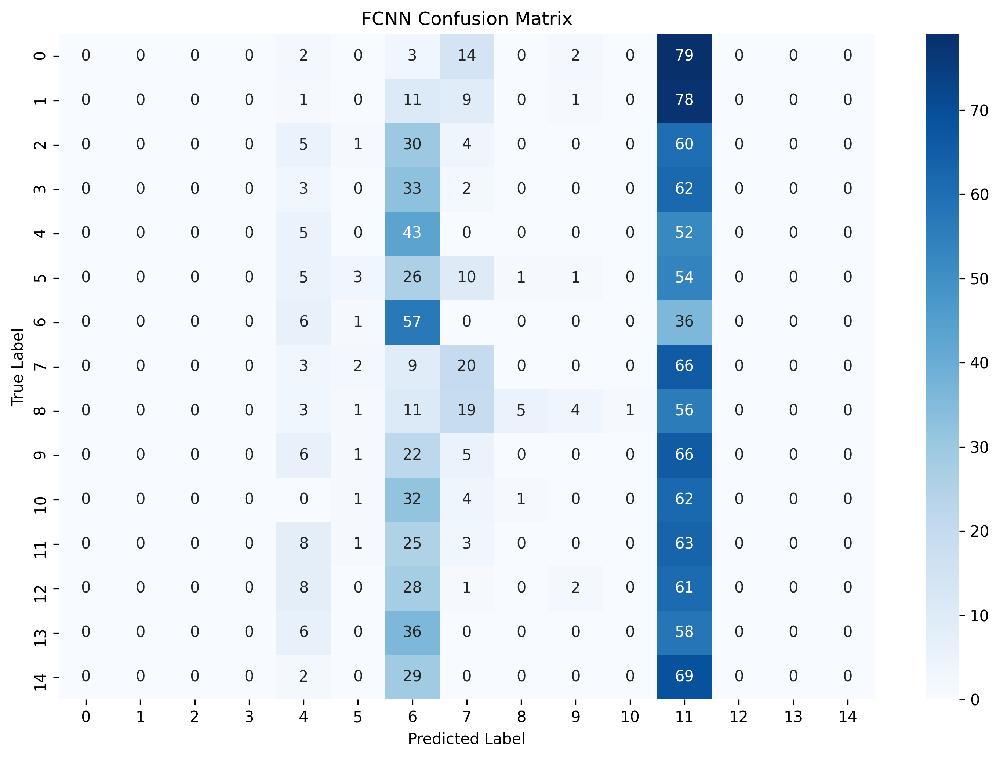
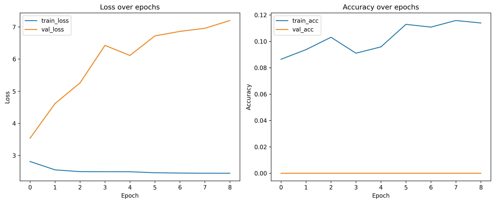

#### Improved FCNN (BatchNorm + Dropout + Class Weights)
**Improvements**: Batch Normalization, Dropout(0.25), Validation split, Class weight balancing

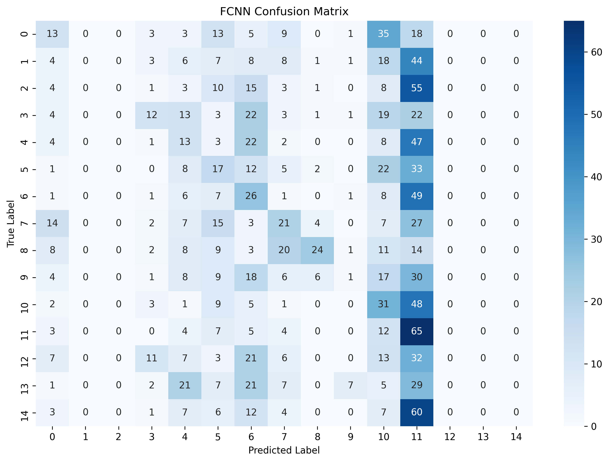
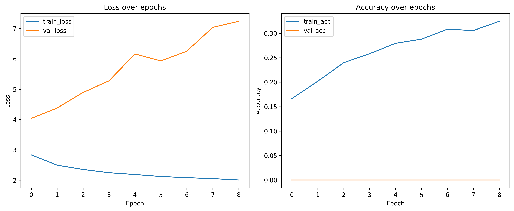

---

### 3. PyTorch Implementation (Phase 3)

#### FCNN with Data Augmentation & LR Scheduling
**Key Techniques**: 
- Data Augmentation (rotation, flip, color jitter)
- ReduceLROnPlateau scheduling
- 128x128 Grayscale conversion variant

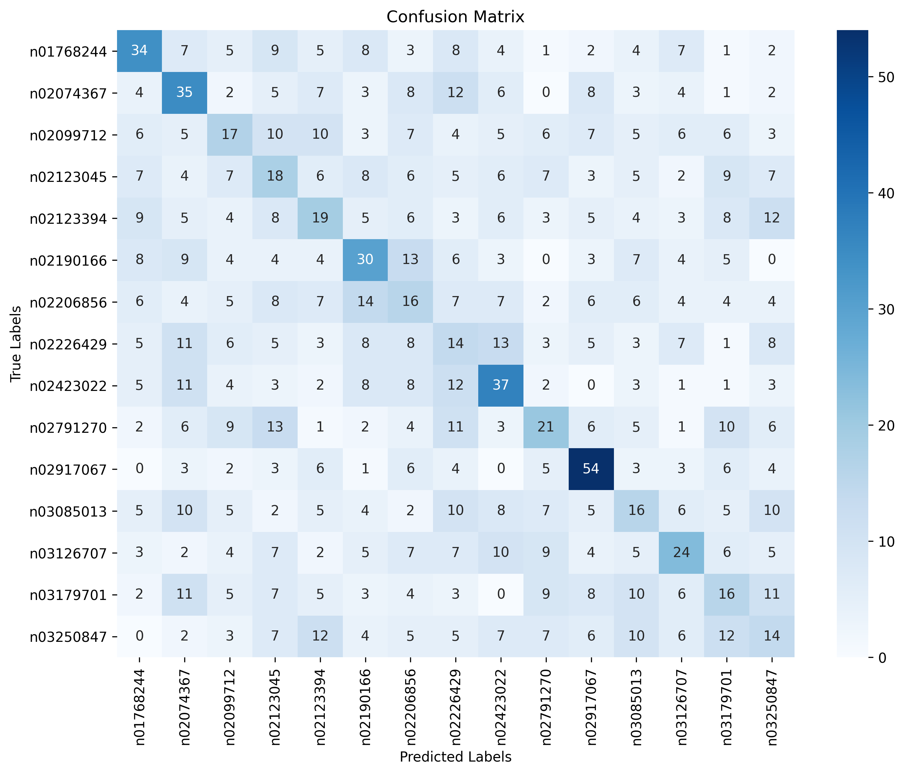
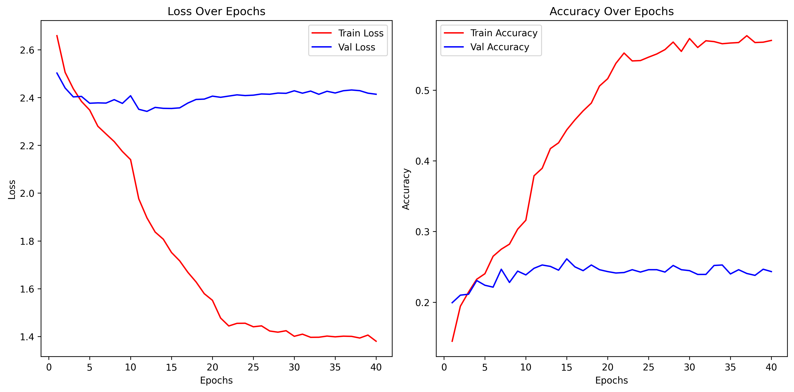

#### Learning Rate Scheduling Visualization
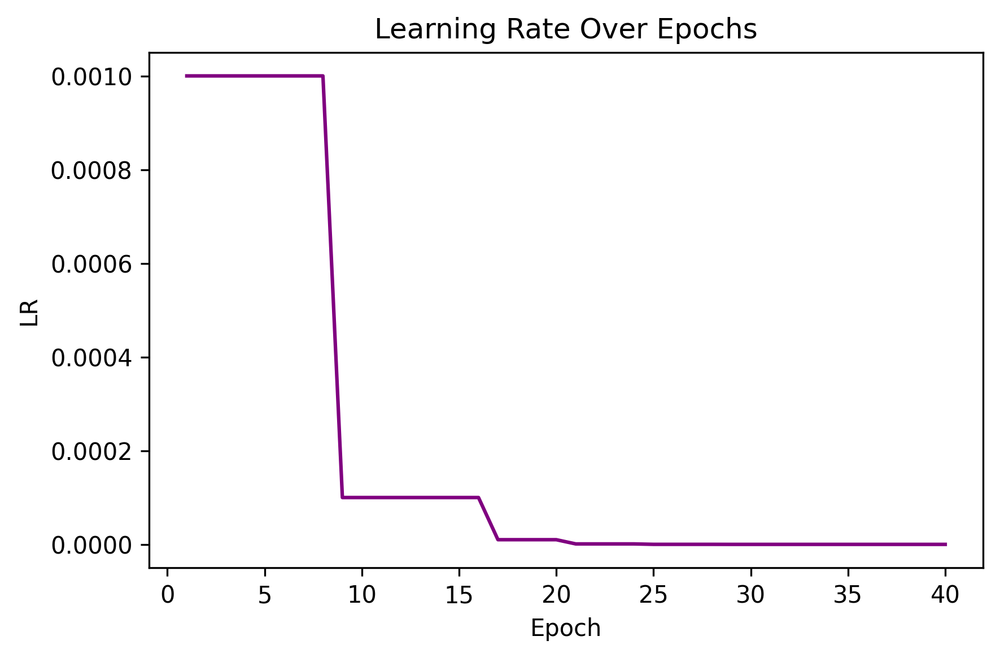

---

### 4. Advanced CNN (Phase 4) ⭐ Best Performance

**Architecture**: Convolutional layers with advanced regularization

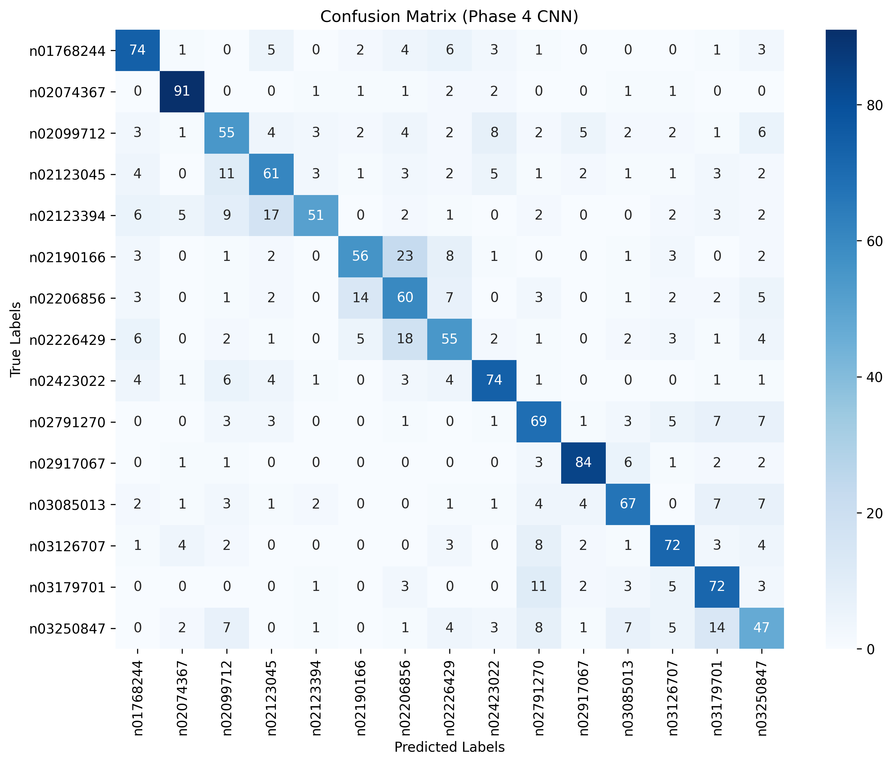
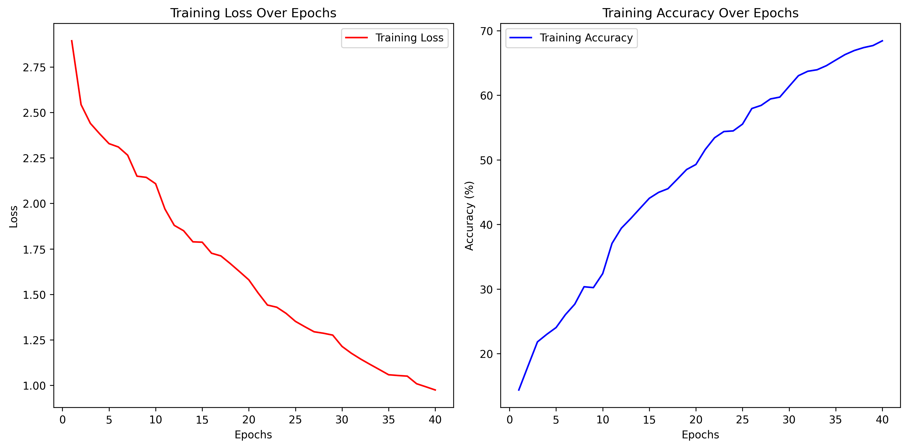

---

## Detailed Metrics

Detailed classification reports (precision, recall, F1-score per class) are available in:
- `results/metrics/` - Text files with full scikit-learn classification reports

## Repository Structure

## Key Findings

1. **Traditional vs Deep Learning**: Transition from hand-crafted features (SIFT/ORB) to learned representations shows significant improvement in class separation
2. **Regularization Impact**: Batch Normalization and Dropout reduced overfitting substantially in FCNN models
3. **Data Augmentation**: Phase 3 augmentation strategies improved generalization on limited training data
4. **CNN Superiority**: Convolutional architectures (Phase 4) outperformed fully connected networks by capturing spatial hierarchies

## Technologies Used

- **Traditional CV**: OpenCV (SIFT, ORB), Scikit-learn (SVM, GMM, Fisher Vector)
- **Deep Learning**: TensorFlow/Keras, PyTorch
- **Visualization**: Matplotlib, Seaborn
- **Data**: TinyImageNet-100 (100 classes)

---

*Note: Dataset and trained model weights (>100MB) are excluded from this repository per GitHub size limits.*
